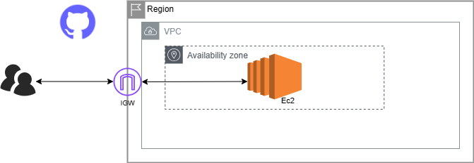

## Architecture

User Data Script:

The EC2 instance is configured using the following user data script during launch:
#!/bin/bash

sudo su
yum update -y
yum install -y httpd
cd /var/www/html
wget  https://s3.amazonaws.com/myaws.bucket456/mole.zip
unzip mole.zip
cp -r mole-main/* /var/www/html/
rm -rf mole.zip
systemctl enable httpd
systemctl start httpd
.

**README.md**
Static Website Deployment on Amazon EC2
This repository provides the necessary files and instructions for deploying a static website on an Amazon EC2 instance using the Amazon Linux 2 AMI.

**Prerequisites**
An AWS account with access to the EC2 service.
Basic knowledge of AWS EC2 and security groups.
Instructions
Launching EC2 Instance
Launch a new EC2 instance using the Amazon Linux 2 AMI or a suitable AMI.
Use the default VPC/SUBNET.
Enable the public IP for the instance.
Configure the security group to allow inbound traffic on port 80 (HTTP).
User Data Script
During the EC2 instance launch, use the following User Data script:

**bash**

#!/bin/bash

sudo su
sudo yum update -y
sudo yum install -y httpd
cd /var/www/html
wget https://github.com/Busayor123/Host-static-webSite-on-Ec2/archive/refs/heads/main.zip
unzip main.zip
cp -r mole-main/* /var/www/html/
rm -rf main.zip
systemctl enable httpd
systemctl start httpd
This script installs the Apache web server, downloads your website files from the specified GitHub repository, and starts the web server.

Accessing the Website
Once the EC2 instance is running and the web server is started, access your static website by navigating to the public IP of your EC2 instance in a web browser.

**Author
[Oluwabusayo Abati]**

****

